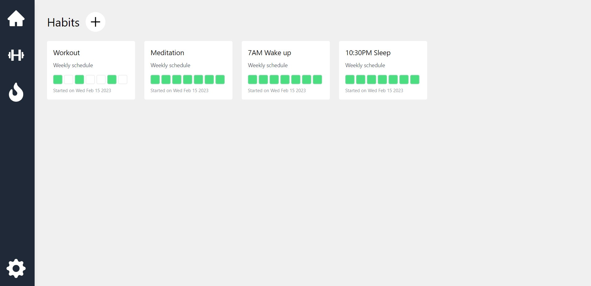
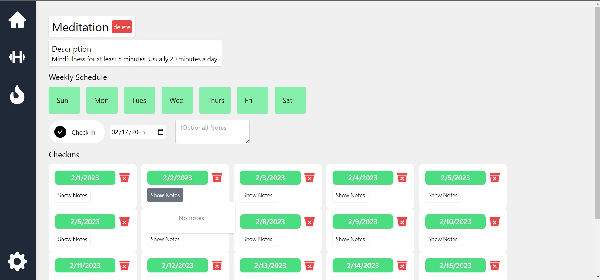
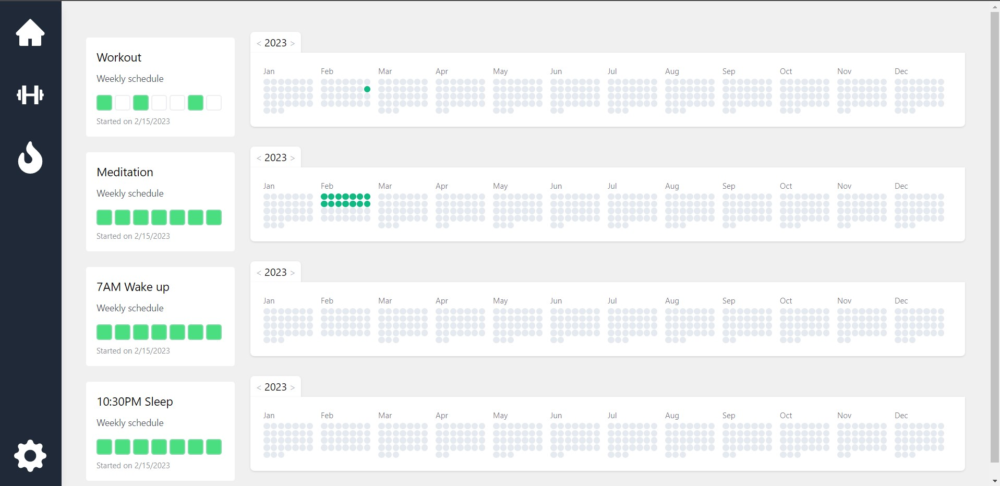
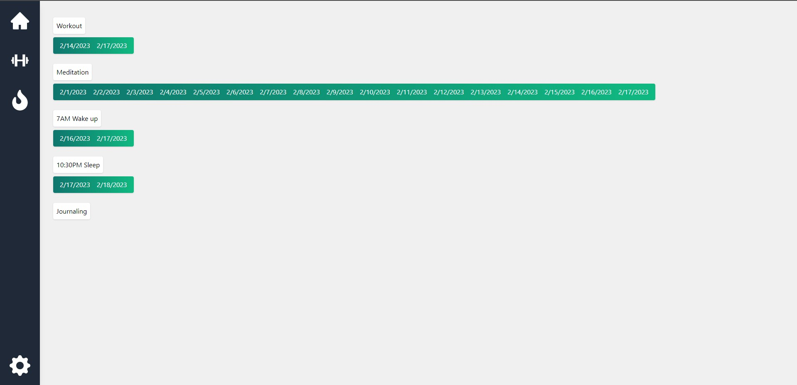

# HabiTracker

Track your habits and checkin everyday to maintain the streak.

## Features:
1. Set your own schedule for specific habits
   1. Eg. workout Monday, Tuesday, Thursday
2. Daily checkin
3. Write notes/description of habits
4. Keep track of streaks
   1. streaks are calculated according to schedule for a particular habit
5. Yearly view of habit checkins, similar to github activity log

## To Do:

Add Highlights in streaks for top 3 longest streaks if the user even has 3 set of streaks
Stop habit feature: user cant checkin anymore, but can see the checkin history for a habit they stopped doing

Design idea for streaks: add chains from checkin to checkin to symbolize "don't break the chain"

__ISSUES__:
If the checkin button is clicked multiple times very quickly, the browser doesnt have enough time to check that the user already signed in.

Caching API calls for SSR is not working as intended.

Streaks: Still in progress in terms of design, but works with weekly schedule now
